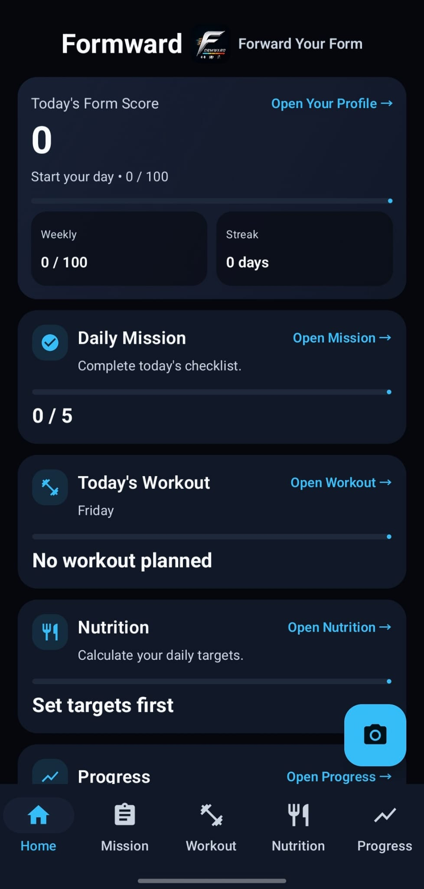
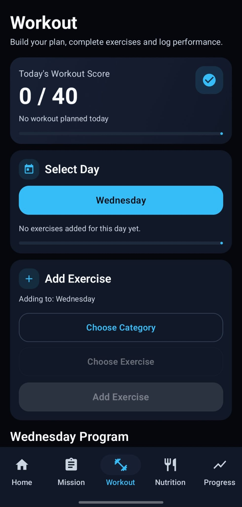
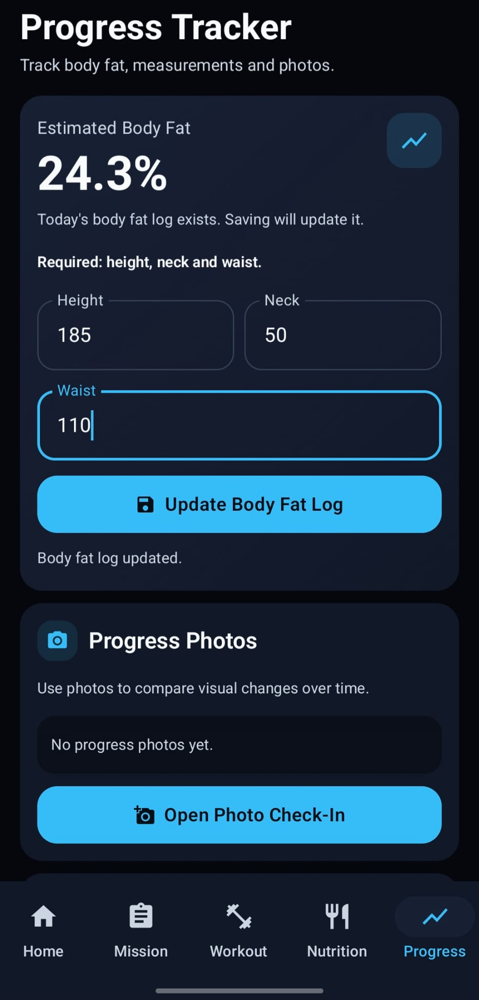
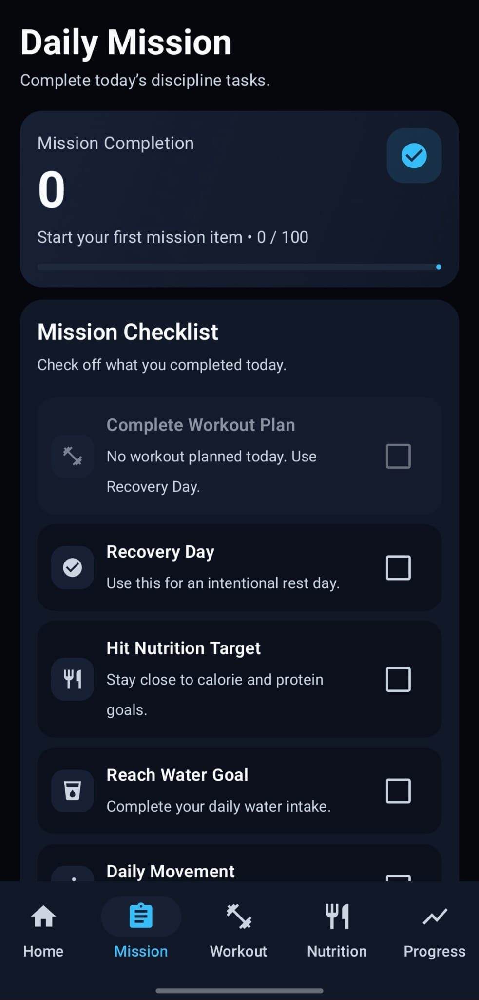
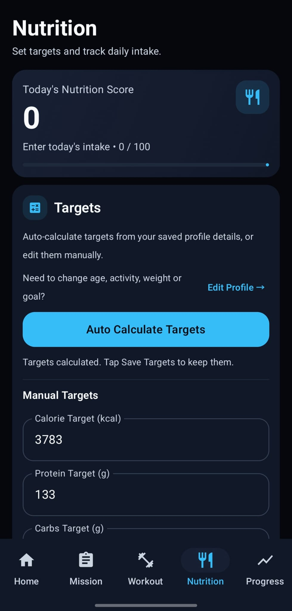
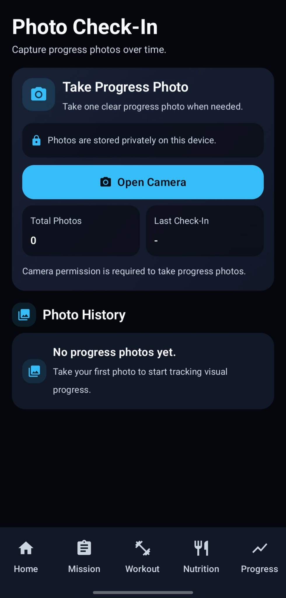

# Formward

**Android fitness app built with Kotlin, Jetpack Compose and Firebase.**

Formward keeps workout planning, nutrition, daily habits and body progress in one place. It also calculates a daily **Form Score** based on the user's activity and progress.

  
  
  

## Features

- Daily Form Score, weekly score and streak tracking
- Daily missions for workout/recovery, nutrition, water, movement and sleep
- Workout planning with exercises, sets, reps and weight tracking
- Workout history
- Daily calorie and macro tracking
- Nutrition targets calculated from profile information and fitness goals
- Body measurements and body fat tracking
- Progress history
- Progress photo check-ins stored locally on the device
- User profile and initial setup
- Firebase-backed cloud storage for profile, workout, nutrition, score and progress data

## App Screens

  
  
  

## Tech Stack

- Kotlin
- Jetpack Compose
- Material 3
- Navigation Compose
- Firebase Authentication
- Cloud Firestore
- SharedPreferences

## Technical Details

- UI built with Jetpack Compose and reusable components
- Navigation between Home, Mission, Workout, Nutrition, Progress, Profile and Photo Check-In screens
- Form Score calculated from workout/recovery, nutrition and daily mission progress
- Weekly score and streak tracking
- Nutrition target calculation for calories, protein, carbohydrates, fat and water
- Body fat estimation and measurement history
- Separate Firebase storage logic for workout, nutrition, progress and profile data
- Anonymous Firebase Authentication for user-specific cloud data
- Progress photos stored in the app's private local storage

## Solo Developer

**Yücel Çağakan SAYILIR**

Built Formward end to end, including the product idea, UI/UX, Android development, Firebase integration and application logic.

[GitHub Profile](https://github.com/cagakans)
